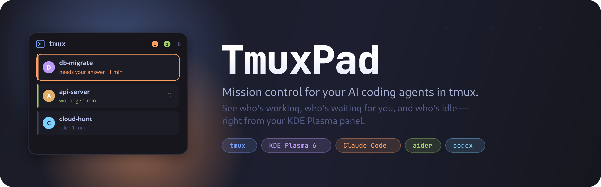
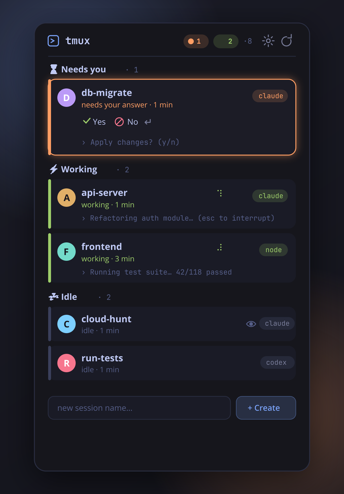

<div align="center">



<br>

**English** · [Русский](README.ru.md)

<br>

[](https://github.com/VladislavTsytrikov/tmuxpad/actions/workflows/ci.yml)
[](LICENSE)
[](https://kde.org/plasma-desktop/)
[](https://github.com/tmux/tmux)

</div>

## What is TmuxPad?

**TmuxPad is a [KDE Plasma 6](https://kde.org/plasma-desktop/) widget (plasmoid) that monitors [tmux](https://github.com/tmux/tmux) sessions and the AI coding agents running inside them.** It detects, in real time, whether each agent is **working**, **waiting for your input**, or **idle** — and surfaces the ones that need you, so you keep a whole fleet of agents productive without babysitting terminals.

If you do "vibe coding" with several agents at once — one refactoring, one writing tests, one stuck on a permission prompt — TmuxPad is the dashboard that tells you, at a glance, **who needs you right now**.

<div align="center">

</div>

## The problem it solves

You spin up three or four AI agents in tmux, switch to something else, and twenty minutes later discover one of them has been sitting on `Apply changes? (y/n)` the entire time — burning your wall-clock, doing nothing. Terminal multiplexers weren't built to tell you *"this pane is blocked on a question."* TmuxPad is.

## Features

- 🟢 **Live agent status** — *working* / *waiting for input* / *idle*, grouped so blocked agents float to the top
- ⏳💬 **Quick reply** — hit **y / n / Enter** for a waiting agent straight from the card, without attaching
- 🔔 **Desktop notifications** — the moment an agent stops working and needs you, or finishes its task
- 👀 **Glanceable output** — the last line each agent printed, right on the card; expand for the full preview
- ⏱️ **Elapsed time** — *"waiting 12 min"* so you instantly see who's been blocked longest
- ⚡ **One-click attach** — opens the session in your terminal of choice (auto-detected)
- ➕ **Create & kill sessions** from the widget
- 🎛️ **Panel mode** — a compact icon with a badge that pulses orange when an agent is waiting
- 🎨 **Native & themed** — follows your Plasma theme; no hardcoded colors

It's also a great plain **tmux session manager** — sessions without an agent are listed under *Terminals*.

## Perfect for

- **Vibe coders** running a fleet of AI agents (Claude Code, aider, codex, opencode, gemini, cursor-agent, crush, goose) in parallel
- Anyone who wants a **desktop notification when an AI agent needs input** instead of polling terminals by hand
- KDE users who want a **tmux dashboard on the panel or desktop**
- Developers orchestrating long-running agent tasks who need to know **which agent is blocked** and for how long

## How agent status detection works

TmuxPad polls tmux every few seconds in a single batched call, and classifies each session:

1. **Pane title spinner.** Claude Code animates a Braille spinner (`⠋⠙⠹…`) in the pane title while busy. If the title starts with one, the agent is **working** — set via an OSC escape, so it works regardless of your tmux `set-titles` / `allow-rename` config.
2. **Content patterns.** The last visible lines of each session are matched against configurable regex lists:
   - *waiting*: `Do you want`, `❯ 1.`, `(y/n)`, `[Y/n]`, `Press Enter to`, …
   - *working*: `esc to interrupt`, the Claude Code progress line, …
3. **Agent detection.** A session counts as an agent when its foreground process is a known tool (`claude`, `codex`, `aider`, `opencode`, `gemini`, `goose`, `amp`, `crush`, `cursor-agent` — all editable), **or** when it's launched through a runtime like `node cli.js` / `python -m aider`. The pane's process tree is read from `/proc` (portable, no procps-only flags), so runtime-wrapped installs are recognised too.

All three lists live in the widget's settings — when a tool changes its UI or a new one appears, you fix it with **a one-line regex** instead of waiting for a release.

Notifications fire only on transitions out of *working*, and only for **detached** sessions — if you're attached, you already see what's happening.

## Install

### From source (recommended today)

```bash
git clone https://github.com/VladislavTsytrikov/tmuxpad.git
cd tmuxpad
make install        # installs the widget + translations for the current user
```

Then **right-click your panel or desktop → Add Widgets → search "TmuxPad"**. Update later with `git pull && make install`.

Or grab the ready-made package from the [latest release](https://github.com/VladislavTsytrikov/tmuxpad/releases) and install it:

```bash
kpackagetool6 -t Plasma/Applet -i tmuxpad-*.plasmoid
```

### KDE Store

*Coming soon* — search for "TmuxPad" in **Add Widgets → Get New Widgets**.

**Requirements:** KDE Plasma 6, tmux 1.9+. Building translations needs `gettext`.

## Settings

Open settings straight from the popup (the **gear** slides a panel in), or right-click → Configure for the system dialog.

- **Terminal** — TmuxPad scans your machine for installed terminals (Konsole, Ghostty, kitty, WezTerm, Alacritty, foot, GNOME Terminal, Tilix, xterm, and more) and lets you pick one from a dropdown, with a live preview of the launch command. *Automatic* just uses the first one it finds — **zero config**. *Custom command* covers anything exotic.
- **Updates** — refresh interval and how many output lines to capture.
- **Notifications** — toggle the *waiting* and *finished* notifications.
- **AI Agents** — the process names and the *working* / *waiting* regex patterns.

## Compatibility

| Works with | Notes |
|---|---|
| **Plasma 6.0+**, X11 & Wayland | uses only stable Plasma 6 APIs |
| **tmux 1.9+** | `display-message`, `capture-pane`, `pane_pid` are long-standing |
| **Claude Code** | full status detection out of the box |
| **aider / codex / opencode / gemini / others** | detected as agents; *waiting* works via shared prompts, *working* may need one regex tuned to that tool (one line in settings) |
| **Terminal** | ~18 auto-detected (Konsole, Ghostty, kitty, WezTerm, Alacritty, foot, …) plus a custom command |

**Known limits:** only the active pane of each session's active window is inspected (an agent in a background window shows as idle); a desktop-placed widget pauses its timer while fully covered — **for always-on background notifications, put TmuxPad in a panel**, where the timer never sleeps.

## FAQ

**How do I monitor multiple Claude Code / aider / codex agents at once?**
Run each in its own tmux session and add TmuxPad to your panel. It groups them by status and shows which need your input.

**How do I get a notification when an AI coding agent is waiting for input?**
TmuxPad sends a desktop notification the moment an agent transitions from *working* to *waiting* (for detached sessions). Toggle it in settings.

**Does it work with agents other than Claude Code?**
Yes. Any CLI agent in tmux is detected; *waiting* detection works out of the box via common prompts, and you can add a one-line regex for a tool's *working* indicator.

**Is this a terminal, or does it replace tmux?**
Neither — it's a lightweight **monitor and launcher**. Your agents keep running in real tmux; TmuxPad just watches them and opens your terminal on click.

**Does it run on GNOME / other desktops?**
It's a KDE Plasma 6 plasmoid, so it needs Plasma. The detection logic itself is plain tmux + `/proc` and could be ported.

## Related projects

- [TmuxRunner](https://github.com/alex1701c/TmuxRunner) — a KRunner plugin to attach to tmux sessions from Alt+Space. Great companion: TmuxRunner is a launcher, TmuxPad is a live status monitor.

## Roadmap

- Per-window status for multi-window sessions (the orchestrator pattern)
- cwd + git branch on each card
- More built-in detection profiles as agent CLIs evolve

Issues and PRs welcome — especially [detection patterns](.github/ISSUE_TEMPLATE/detection_pattern.md) for tools you use. See [CONTRIBUTING](CONTRIBUTING.md).

## Keywords

tmux session manager · KDE Plasma 6 widget · plasmoid · AI coding agent monitor · Claude Code dashboard · aider / codex / opencode status · tmux notifications · desktop AI agent monitor · Linux developer productivity · vibe coding tools

## License

[MIT](LICENSE) © [Vlad Tsytrikov](https://github.com/VladislavTsytrikov)
