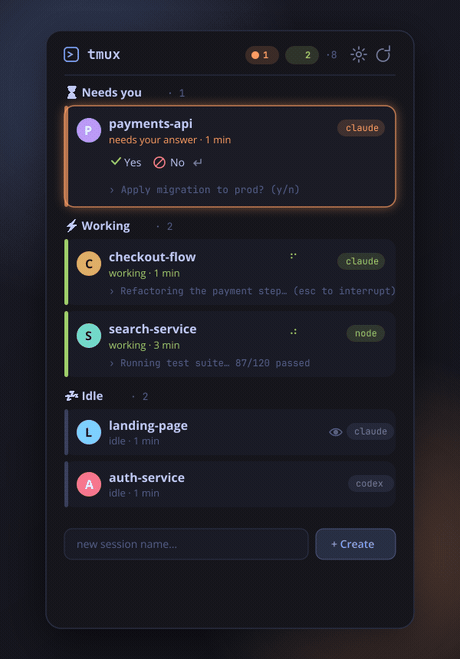
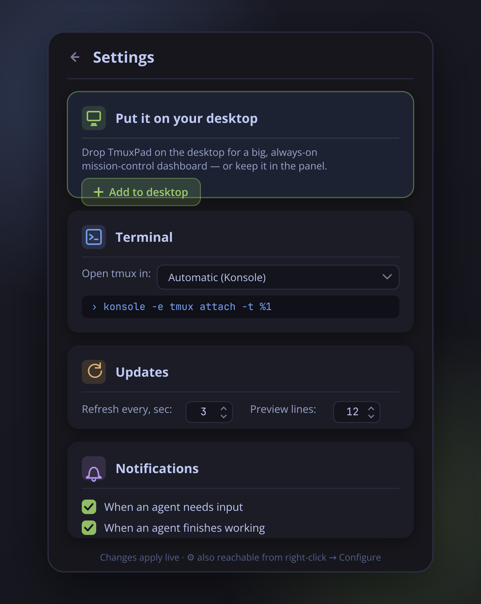

<div align="center">


<br>

[English](README.md) · **Русский**

<br>

[](https://github.com/VladislavTsytrikov/tmuxpad/actions/workflows/ci.yml)
[](LICENSE)
[](https://kde.org/plasma-desktop/)
[](https://github.com/tmux/tmux)

</div>

## Что такое TmuxPad?

**TmuxPad — это виджет [KDE Plasma 6](https://kde.org/plasma-desktop/) (плазмоид), который следит за сессиями [tmux](https://github.com/tmux/tmux) и AI-агентами внутри них.** Он в реальном времени определяет, что делает каждый агент — **работает**, **ждёт твоего ответа** или **простаивает** — и поднимает наверх тех, кому ты сейчас нужен. Так целый флот агентов остаётся продуктивным без постоянного переключения между терминалами.

Если ты «вайбкодишь» сразу несколькими агентами — один рефакторит, другой пишет тесты, третий завис на запросе подтверждения — TmuxPad это дашборд, который с одного взгляда показывает, **кому ты нужен прямо сейчас**.

<div align="center">

</div>

## Какую проблему решает

Ты запускаешь три-четыре AI-агента в tmux, переключаешься на другое, а через двадцать минут обнаруживаешь, что один из них всё это время висел на `Apply changes? (y/n)` — впустую жёг твоё время. Терминальные мультиплексоры не умеют сказать *«эта панель застряла на вопросе»*. TmuxPad умеет.

## Возможности

- 🟢 **Живой статус агента** — *работает* / *ждёт ввода* / *простаивает*, сгруппировано так, что заблокированные всплывают наверх
- ⏳💬 **Быстрый ответ** — нажми **y / n / Enter** для ждущего агента прямо с карточки, не подключаясь
- 🔔 **Уведомления на рабочий стол** — в момент, когда агент перестал работать и ждёт тебя, или закончил задачу
- 👀 **Превью вывода** — последняя строка, которую агент напечатал, прямо на карточке; разверни для полного превью
- ⏱️ **Время ожидания** — *«ждёт 12 мин»*, чтобы сразу видеть, кто завис дольше всех
- ⚡ **Подключение в один клик** — открывает сессию в твоём терминале (определяется автоматически)
- ➕ **Создание и завершение сессий** прямо из виджета
- 🖥️ **Дашборд на рабочем столе или иконка в панели** — помести на рабочий стол как большой постоянный пульт, или оставь компактным в панели. **Одна кнопка добавляет его на рабочий стол** прямо из настроек — без копания в «Добавить виджеты».
- 🎨 **Нативно и по теме** — следует твоей теме Plasma; никаких захардкоженных цветов

Это ещё и отличный **менеджер tmux-сессий** — сессии без агента показаны в разделе *Терминалы*.

## Кому подойдёт

- **Вайбкодерам**, которые гоняют флот AI-агентов (Claude Code, aider, codex, opencode, gemini, cursor-agent, crush, goose) параллельно
- Всем, кому нужно **уведомление, когда AI-агент ждёт ввода**, вместо ручного обхода терминалов
- Пользователям KDE, которым нужен **дашборд tmux на панели или рабочем столе**
- Разработчикам долгих агентных задач, которым важно знать, **какой агент заблокирован** и насколько давно

## Как работает определение статуса

TmuxPad опрашивает tmux раз в несколько секунд одним пакетным вызовом и классифицирует каждую сессию:

1. **Спиннер в заголовке панели.** Claude Code анимирует Брайль-спиннер (`⠋⠙⠹…`) в заголовке панели, пока занят. Если заголовок начинается с него — агент **работает**. Это ставится через OSC-escape, поэтому работает независимо от настроек tmux `set-titles` / `allow-rename`.
2. **Паттерны по содержимому.** Последние видимые строки каждой сессии сверяются с настраиваемыми regex-списками:
   - *ждёт*: `Do you want`, `❯ 1.`, `(y/n)`, `[Y/n]`, `Press Enter to`, …
   - *работает*: `esc to interrupt`, строка прогресса Claude Code, …
3. **Распознавание агента.** Сессия считается агентской, если её активный процесс — известный инструмент (`claude`, `codex`, `aider`, `opencode`, `gemini`, `goose`, `amp`, `crush`, `cursor-agent` — список редактируемый), **либо** если он запущен через рантайм вроде `node cli.js` / `python -m aider`. Дерево процессов панели читается из `/proc` (переносимо, без procps-специфичных флагов), так что обёрнутые установки тоже распознаются.

Все три списка живут в настройках виджета — когда инструмент меняет интерфейс или появляется новый, ты правишь это **одной строкой regex**, а не ждёшь релиза.

Уведомления приходят только при переходе из *работает* и только для **отключённых** сессий — если ты подключён, ты и так всё видишь.

## Установка

### Одной командой — без клонирования и сборки ⭐

```bash
curl -fsSL https://raw.githubusercontent.com/VladislavTsytrikov/tmuxpad/main/install.sh | sh
```

Скачивает `.plasmoid` из последнего релиза и ставит его (переводы внутри). Затем добавь виджет — **правый клик по рабочему столу или панели → Добавить виджеты → «TmuxPad»** — или открой настройки виджета и нажми **Добавить на рабочий стол** для дашборда в один клик.

### Из исходников

```bash
git clone https://github.com/VladislavTsytrikov/tmuxpad.git
cd tmuxpad
make install        # ставит виджет + переводы для текущего пользователя
```

Обновление: `git pull && make install`.

### KDE Store

*Скоро* — ищи «TmuxPad» в **Добавить виджеты → Загрузить новые**.

**Требования:** KDE Plasma 6, tmux 1.9+. При установке из исходников переводы собираются через `gettext`.

## Настройки

<div align="center">

</div>

Открой настройки прямо из попапа (**шестерёнка** выезжает панелью) или правый клик → Настроить для системного диалога.

- **Размести на рабочем столе** — одна кнопка кладёт полноценный дашборд на рабочий стол. Иконку в панели тоже оставь — они работают вместе.
- **Терминал** — TmuxPad сканирует машину на установленные терминалы (Konsole, Ghostty, kitty, WezTerm, Alacritty, foot, GNOME Terminal, Tilix, xterm и другие) и даёт выбрать из списка, с живым превью команды запуска. *Автоматически* просто берёт первый найденный — **ноль настройки**. *Своя команда* — для всего экзотического.
- **Обновление** — интервал опроса и сколько строк вывода захватывать.
- **Уведомления** — переключатели уведомлений *ждёт* и *закончил*.
- **AI-агенты** — имена процессов и regex-паттерны *работает* / *ждёт*.

## Совместимость

| Работает с | Примечания |
|---|---|
| **Plasma 6.0+**, X11 и Wayland | использует только стабильные API Plasma 6 |
| **tmux 1.9+** | `display-message`, `capture-pane`, `pane_pid` существуют давно |
| **Claude Code** | полное определение статуса из коробки |
| **aider / codex / opencode / gemini / другие** | распознаются как агенты; *ждёт* работает по общим промптам, *работает* может потребовать один regex под конкретный инструмент (одна строка в настройках) |
| **Терминал** | ~18 определяются автоматически (Konsole, Ghostty, kitty, WezTerm, Alacritty, foot, …) плюс своя команда |

**Известные ограничения:** проверяется только активная панель активного окна каждой сессии (агент в фоновом окне покажется простаивающим); виджет на рабочем столе приостанавливает таймер, пока стол полностью перекрыт — **для фоновых уведомлений всегда ставь TmuxPad на панель**, там таймер не спит.

## FAQ

**Как следить сразу за несколькими агентами Claude Code / aider / codex?**
Запусти каждого в своей tmux-сессии и добавь TmuxPad на панель. Он сгруппирует их по статусу и покажет, кому нужен ввод.

**Как получить уведомление, когда AI-агент ждёт ввода?**
TmuxPad шлёт уведомление на рабочий стол в момент перехода агента из *работает* в *ждёт* (для отключённых сессий). Включается в настройках.

**Работает ли с агентами кроме Claude Code?**
Да. Любой CLI-агент в tmux распознаётся; *ждёт* работает из коробки по типовым промптам, а для индикатора *работает* можно добавить одну строку regex.

**Это терминал? Он заменяет tmux?**
Ни то, ни другое — это лёгкий **монитор и лаунчер**. Твои агенты продолжают работать в настоящем tmux; TmuxPad просто следит за ними и открывает твой терминал по клику.

**Запустится ли на GNOME / других DE?**
Это плазмоид KDE Plasma 6, ему нужна Plasma. Сама логика определения — чистый tmux + `/proc` и может быть портирована.

## Похожие проекты

- [TmuxRunner](https://github.com/alex1701c/TmuxRunner) — KRunner-плагин для подключения к tmux-сессиям из Alt+Space. Отличный сосед: TmuxRunner — лаунчер, TmuxPad — живой монитор статуса.

## Планы

- Статус по окнам для многооконных сессий (паттерн оркестратора)
- cwd + git-ветка на каждой карточке
- Больше встроенных профилей детекта по мере развития агентных CLI

Issues и PR приветствуются — особенно [паттерны детекта](.github/ISSUE_TEMPLATE/detection_pattern.md) для инструментов, которыми ты пользуешься. См. [CONTRIBUTING](CONTRIBUTING.md).

## Лицензия

[MIT](LICENSE) © [Vlad Tsytrikov](https://github.com/VladislavTsytrikov)
